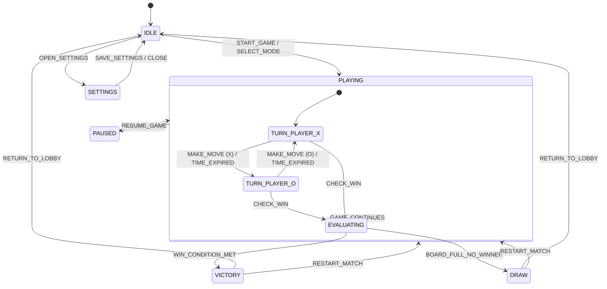

# Ultra-Premium Tic-Tac-Toe Web Application Architecture & Specification

## 1. System Overview & Tech Stack
The **Ultra-Premium Tic-Tac-Toe** web app is engineered to deliver a hyper-engaging, futuristic arcade experience. It combines algorithmic depth (Unbeatable Minimax AI, Ultimate Tic-Tac-Toe, Quantum mode) with modern web design (Glassmorphism, Neon Glows, Framer Motion animations, Web Audio API sound synthesizers).

### Core Technology Stack
- **Framework & Build System**: Vite + React 18 + TypeScript (ESNext target, strict mode)
- **Styling Engine**: Tailwind CSS v3 with custom theme extensions, keyframe animations, glassmorphism filters, and neon glow utility classes
- **UI Components & Icons**: Lucide React + custom animated SVG components
- **Motion & Visual Effects**: Framer Motion for UI state transitions, Canvas Confetti for victory celebrations
- **Audio System**: Howler.js + Web Audio API synthesizer for dynamic sound FX and ambient BGM
- **State Management**: Pure TypeScript Finite State Machine (FSM) pattern via `useReducer` for predictable, deterministic state transitions

---

## 2. Directory & File Structure
```
tictac-agy/
├── index.html
├── package.json
├── tsconfig.json
├── tsconfig.node.json
├── vite.config.ts
├── tailwind.config.js
├── postcss.config.js
├── docs/
│   └── ARCHITECTURE.md
└── src/
    ├── main.tsx
    ├── App.tsx
    ├── index.css
    ├── vite-env.d.ts
    ├── types/
    │   └── game.ts
    ├── state/
    │   └── gameStateMachine.ts
    ├── audio/
    │   └── soundEffects.ts
    ├── ai/
    │   ├── minimaxEngine.ts
    │   ├── heuristicEngine.ts
    │   └── randomEngine.ts
    ├── components/
    │   ├── Header.tsx
    │   ├── Board.tsx
    │   ├── Cell.tsx
    │   ├── ScoreBoard.tsx
    │   ├── TimerBar.tsx
    │   ├── PowerUpBar.tsx
    │   ├── UltimateBoard.tsx
    │   ├── VictoryModal.tsx
    │   ├── SettingsModal.tsx
    │   └── ThemeSelector.tsx
    └── utils/
        ├── winEvaluator.ts
        └── storage.ts
```

---

## 3. Finite State Machine (FSM) Diagram



---

## 4. Game Modes & Algorithmic Specifications

### 4.1 AI Engine (Minimax with Alpha-Beta Pruning)
- **Unbeatable Mode**: Evaluates full game tree for 3x3 grids. Guarantees 0% loss rate (win or draw).
- **Depth-Weighted Utility Function**:
  $$\text{Score} = \begin{cases} 10 - \text{depth} & \text{if AI wins} \\ \text{depth} - 10 & \text{if Human wins} \\ 0 & \text{if Draw} \end{cases}$$
- **Medium / Heuristic Mode**: Uses 3-ply lookahead with heuristic center/corner control evaluation.
- **Easy Mode**: Pseudo-random valid space selector with 25% tactical blocking chance.

### 4.2 Grid Variations & Win Logic
- **Standard 3x3**: Requires 3 in a row (8 combinations).
- **Extended 4x4 / 5x5**: Configurable win-streak requirements (3, 4, or 5 in a row).
- **Ultimate Tic-Tac-Toe**: 9 sub-boards arranged in a 3x3 grid. Playing in cell $(r, c)$ of a sub-board forces the next opponent's move into sub-board $(r, c)$.

---

## 5. UI/UX Feature Spec Sheet
1. **Themes**: Cyberpunk Neon, Glassmorphism Frost, Retro Synthwave 80s, Minimalist Luxury Gold, Cosmic Nebula.
2. **Audio Experience**: Haptic-synced click sounds, move placement tones, win fanfare, turn countdown tick audio.
3. **Power-Ups (Optional Tactical Mode)**:
   - **Wildcard**: Place a universal symbol matching either player.
   - **Time Rewind**: Undo last move pair.
   - **Double Move**: Take 2 turns in succession.
4. **Persistence**: LocalStorage caching for player stats, win-streaks, audio preferences, and chosen theme.
